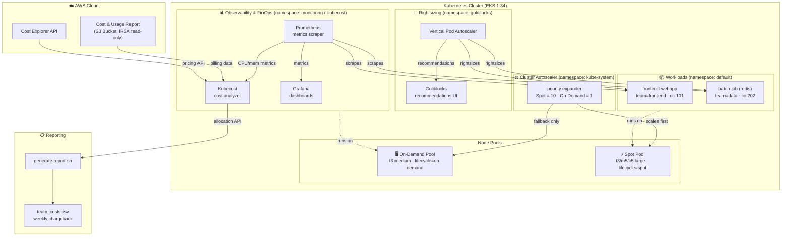

# FinOps Platform – Kubernetes Cloud Cost Optimization

A FinOps platform built with **Kubecost**, **Terraform**, **Goldilocks**, **VPA**, and **Cluster Autoscaler** to monitor, rightsize, and optimize Kubernetes cloud spend on AWS EKS.

---

## Architecture



### Data flow

| Step | From | To | What happens |
|------|------|----|-------------|
| 1 | Kubernetes pods | Prometheus | CPU, memory, network scraped every 30s |
| 2 | Prometheus | Kubecost | Raw metrics cross-referenced with AWS pricing |
| 3 | AWS CUR / Cost Explorer | Kubecost | Real billing data synced via IRSA (24–48h delay for CUR to populate) |
| 4 | Prometheus | Grafana | Cost + efficiency panels via PromQL |
| 5 | Pod history | VPA | Recommends rightsized CPU/memory requests |
| 6 | VPA | Goldilocks | Displays recommendations in visual dashboard |
| 7 | Pending pods | Cluster Autoscaler | Triggers Spot nodes first (priority = 10), On-Demand only as fallback |
| 8 | Kubecost API | generate-report.sh | Produces weekly CSV grouped by `team` label |

---

## Directory Structure

```
finops-platform/
├── terraform/
│   ├── main.tf                    # EKS cluster, VPC, providers, node group definitions
│   ├── variables.tf               # Input variables (region, AZs, K8s version, CIDRs, sizing)
│   ├── outputs.tf                 # Cluster endpoint, IAM role ARNs, VPC/subnet IDs
│   ├── node_pools.tf              # Shared locals used by node groups in main.tf
│   └── iam.tf                     # IRSA roles for Kubecost billing + Cluster Autoscaler, CUR S3 bucket
├── kubernetes/
│   ├── namespaces.yaml            # kubecost, monitoring, goldilocks namespaces + default relabel
│   ├── kubecost/
│   │   └── values.yaml            # Kubecost Helm values (requires env substitution — see below)
│   ├── observability/
│   │   ├── prometheus.yaml        # Prometheus Deployment, ConfigMap, RBAC, PVC (raw manifest)
│   │   └── grafana.yaml           # Grafana Deployment + FinOps dashboard ConfigMap (raw manifest)
│   ├── rightsizing/
│   │   ├── goldilocks.yaml        # Goldilocks controller + dashboard (raw manifest)
│   │   └── vpa-policies.yaml      # VPA resources for batch-job (Auto) and frontend-webapp (Initial)
│   ├── autoscaling/
│   │   └── cluster-autoscaler-values.yaml  # CA Deployment + priority ConfigMap (raw manifest)
│   └── workloads/
│       ├── web-app.yaml           # frontend team (Nginx, intentionally over-provisioned), namespace: default
│       └── batch-job.yaml         # data team (Redis), namespace: default
├── scripts/
│   ├── generate-report.sh         # Kubecost /model/allocation API → CSV chargeback report
│   └── verify.sh                  # Automated platform verification (used by submission.yml)
├── local/
│   ├── mock-billing/
│   │   ├── server.py              # Mock cloud billing endpoint (:9091)
│   │   └── index.html             # Dashboard for the mock billing API
│   └── mock-kubecost/
│       └── server.py              # Mock Kubecost /model/allocation endpoint (:9090)
├── docker-compose.yml             # Local test environment (mock APIs + report generator, no cloud creds needed)
├── .env.example                   # Documents required environment variables
├── submission.yml                 # Automated evaluation config (setup + verify blocks)
└── README.md                      # This file
```

> **Note on `kubernetes/*.yaml` files:** These are hand-written raw Kubernetes manifests (Deployments, Services, ConfigMaps, RBAC), not Helm chart values overlays. Deploy them directly with `kubectl apply -f`, not `helm install -f`. `kubecost/values.yaml` is the one exception — it's a genuine Helm values file intended for the official Kubecost chart.

---

## Prerequisites

| Tool        | Version  | Install |
|-------------|----------|---------|
| Terraform   | ≥ 1.5    | https://developer.hashicorp.com/terraform/install |
| AWS CLI     | ≥ 2.0    | https://aws.amazon.com/cli/ |
| kubectl     | ≥ 1.28   | https://kubernetes.io/docs/tasks/tools/ |
| helm        | ≥ 3.12   | https://helm.sh/docs/intro/install/ (needed only for Kubecost) |
| Docker      | ≥ 24.0   | https://docs.docker.com/engine/install/ |
| docker-compose | ≥ 2.20 | Bundled with Docker Desktop |

---

## Quick Start

### 1. Clone and configure

```bash
git clone <your-repo-url> finops-platform
cd finops-platform
cp .env.example .env
# Edit .env with your AWS account ID and region
```

### 2. Provision infrastructure

```bash
cd terraform
terraform init
terraform plan -out=tfplan
terraform apply "tfplan"
```

After apply, configure kubectl:
```bash
aws eks update-kubeconfig --region us-east-1 --name finops-platform
kubectl get nodes -L lifecycle   # Verify on-demand and spot labels
```

### 3. Deploy namespaces

```bash
cd ..
kubectl apply -f kubernetes/namespaces.yaml
```

### 4. Deploy Kubecost (Helm chart)

```bash
helm repo add kubecost https://kubecost.github.io/cost-analyzer/
helm repo update

KUBECOST_ROLE_ARN=$(terraform -chdir=terraform output -raw kubecost_iam_role_arn)
BILLING_BUCKET=$(terraform -chdir=terraform output -raw billing_report_bucket_name)

helm upgrade --install kubecost kubecost/cost-analyzer \
  --namespace kubecost \
  --set serviceAccount.annotations."eks\.amazonaws\.com/role-arn"="${KUBECOST_ROLE_ARN}" \
  --set kubecostProductConfigs.athenaBucketName="s3://${BILLING_BUCKET}" \
  -f kubernetes/kubecost/values.yaml
```

Verify:
```bash
kubectl get pods -n kubecost
kubectl port-forward -n kubecost deployment/kubecost-cost-analyzer 9090:9090
# Open http://localhost:9090
```

### 5. Deploy Prometheus & Grafana (raw manifests)

```bash
kubectl apply -f kubernetes/observability/prometheus.yaml
kubectl apply -f kubernetes/observability/grafana.yaml
```

Grafana requires an admin password Secret, which isn't defined in the manifest itself — create it before applying, or the pod will fail with `CreateContainerConfigError`:
```bash
kubectl create secret generic grafana-admin -n monitoring \
  --from-literal=password='<choose-a-password>'
```

Verify:
```bash
kubectl get pods -n monitoring
kubectl port-forward -n monitoring deployment/grafana 3000:3000
# Open http://localhost:3000 (user: admin, password: as set above)
```

### 6. Deploy VPA controller (one-time cluster prerequisite)

Goldilocks requires the upstream Kubernetes VPA components, which are **not bundled** in this repo and must be installed separately:
```bash
git clone https://github.com/kubernetes/autoscaler.git /tmp/autoscaler
cd /tmp/autoscaler/vertical-pod-autoscaler
./hack/vpa-up.sh
cd -
kubectl get crd | grep verticalpodautoscaler   # Confirms CRDs installed
```

### 7. Deploy Goldilocks & apply VPA policies

```bash
kubectl apply -f kubernetes/rightsizing/goldilocks.yaml
kubectl apply -f kubernetes/rightsizing/vpa-policies.yaml
```

Verify:
```bash
kubectl get pods -n goldilocks
kubectl port-forward -n goldilocks svc/goldilocks-dashboard 8080:80
# Open http://localhost:8080 – see rightsizing recommendations for frontend-webapp and batch-job
```

### 8. Deploy workloads

```bash
kubectl apply -f kubernetes/workloads/web-app.yaml
kubectl apply -f kubernetes/workloads/batch-job.yaml

# Verify labels (all workloads run in the default namespace)
kubectl get pods -n default --show-labels
```

### 9. Deploy Cluster Autoscaler (raw manifest)

```bash
CA_ROLE_ARN=$(terraform -chdir=terraform output -raw cluster_autoscaler_iam_role_arn)

# Substitute the IAM role ARN placeholder before applying
sed "s|\${CLUSTER_AUTOSCALER_ROLE_ARN}|${CA_ROLE_ARN}|" \
  kubernetes/autoscaling/cluster-autoscaler-values.yaml | kubectl apply -f -
```

> The manifest's `ServiceAccount` annotation uses a `${CLUSTER_AUTOSCALER_ROLE_ARN}` placeholder. Applying the file directly with plain `kubectl apply -f` (without substitution) will succeed but leave the literal placeholder string in place, causing the pod to crash with `WebIdentityErr: Request ARN is invalid`. Always substitute first, as shown above.

Test elastic scaling:
```bash
kubectl scale deployment frontend-webapp --replicas=50 -n default
kubectl get nodes -w   # Watch new Spot nodes appear
```

### 10. Generate a cost report

```bash
# Against live cluster (port-forward Kubecost first, see Step 4)
bash scripts/generate-report.sh

# Or against the local mock (no cluster or AWS credentials needed)
docker-compose up -d mock-billing-api mock-kubecost
KUBECOST_URL=http://localhost:9090 bash scripts/generate-report.sh
```

### 11. Run verification

```bash
bash scripts/verify.sh
```

`verify.sh` checks that the `kubecost`, `monitoring`, `goldilocks`, and `default` namespaces exist, confirms Kubecost/Prometheus/Grafana/Goldilocks pods are Running, confirms `batch-job-vpa` exists, and finally executes `generate-report.sh`. Exits `0` on success.

---

## Local Testing (Docker Compose)

Test the full reporting pipeline without any cloud credentials:

```bash
docker-compose up --build
```

This starts:
- `mock-billing-api` on `:9091` — mocks the cloud billing endpoint (dashboard viewable at `http://localhost:9091`)
- `mock-kubecost` on `:9090` — mocks Kubecost's `/model/allocation` API
- `report-generator` — runs `generate-report.sh` against the mock Kubecost API and prints the resulting CSV

View the report after it runs:
```bash
cat scripts/team_costs.csv
```

---

## Cost Optimization Explained

### Why Spot instances?
Spot instances cost up to 90% less than on-demand but can be reclaimed with short notice. This platform mitigates that risk by:
- Running **fault-tolerant workloads** (`frontend-webapp`, `batch-job`) on the Spot pool via `nodeSelector: lifecycle: spot` + a `spotInstance` toleration.
- Running **critical infrastructure** (Kubecost, Prometheus, Grafana, Goldilocks, Cluster Autoscaler) on the On-Demand pool via `nodeSelector: lifecycle: on-demand`, so a Spot interruption never affects the monitoring/cost stack itself.
- Using **multiple instance types** (`t3.large`, `m5.large`, `c5.large`) in the Spot pool to reduce correlated interruption risk.
- Running `frontend-webapp` with 3 replicas behind a ClusterIP Service, so losing one pod to Spot reclamation doesn't cause an outage.

### VPA rightsizing in action
`frontend-webapp` deliberately requests `1000m` CPU / `1Gi` memory for a lightweight Nginx pod — an intentional inefficiency per the task spec. Its VPA policy runs in `Initial` mode, applying data-informed sizing only at pod creation (no disruptive live evictions on this user-facing service). `batch-job`'s VPA runs in `Auto` mode, actively evicting and resizing pods as usage data accumulates — appropriate since it's stateless and already Spot-tolerant.

### Chargeback model
Every workload carries `team`, `environment`, and `cost-center` labels at both the Deployment and Pod-template level. Kubecost's allocation engine attributes cost using these labels; `generate-report.sh` queries the `/model/allocation` endpoint aggregated by `label:team` and outputs a CSV suitable for showback/chargeback reporting.

---

## Teardown

```bash
# Remove Helm release first (prevents dangling LoadBalancer/PV resources)
helm uninstall kubecost -n kubecost

# Remove raw-manifest deployments
kubectl delete -f kubernetes/autoscaling/cluster-autoscaler-values.yaml
kubectl delete -f kubernetes/rightsizing/vpa-policies.yaml
kubectl delete -f kubernetes/rightsizing/goldilocks.yaml
kubectl delete -f kubernetes/observability/grafana.yaml
kubectl delete -f kubernetes/observability/prometheus.yaml
kubectl delete -f kubernetes/workloads/

# Remove VPA controller
cd /tmp/autoscaler/vertical-pod-autoscaler && ./hack/vpa-down.sh && cd -

# Destroy infrastructure
cd terraform && terraform destroy
```

---

## Troubleshooting

**Kubecost shows $0.00 costs**
AWS Cost and Usage Reports take 24–48 hours to populate after being enabled in the AWS Billing console. Until then, Kubecost falls back to public on-demand pricing estimates. This is expected on a freshly provisioned cluster.

**`ImagePullBackOff` on Goldilocks**
The image tag must be a real published release (e.g. `v4.15.1` at `us-docker.pkg.dev/fairwinds-ops/oss/goldilocks`). Check current tags before deploying, as Fairwinds does not publish under every semver-looking tag.

**Cluster Autoscaler crash-loops with `WebIdentityErr: Request ARN is invalid`**
The `${CLUSTER_AUTOSCALER_ROLE_ARN}` placeholder in `cluster-autoscaler-values.yaml` was applied literally instead of substituted. See Step 9 above.

**Cluster Autoscaler logs `cannot get resource "leases"`**
The `ClusterRole` needs a `coordination.k8s.io` / `leases` rule for leader election; this is included in the current version of `cluster-autoscaler-values.yaml`.

**VPA not updating pods**
Confirm `updateMode` in `vpa-policies.yaml` — `Auto` restarts pods to apply new sizing; `Initial` only applies sizing to newly created pods; `Off` only generates recommendations. VPA also needs the upstream VPA controller installed (Step 6) before it can do anything.

**EBS CSI driver pods `CrashLoopBackOff`**
Check `kubectl logs -n kube-system <ebs-csi-controller-pod> --previous` for `UnauthorizedOperation` errors. The node's IAM role needs the `AmazonEBSCSIDriverPolicy` attached (or, for production use, a dedicated IRSA role for `ebs-csi-controller-sa` mirroring the pattern already used for Kubecost in `iam.tf`).

**CA creates On-Demand instead of Spot nodes**
Verify the priority expander ConfigMap is applied and workloads carry the `spotInstance` toleration. Pods without it force On-Demand scheduling regardless of CA configuration.

**`terraform destroy` hangs**
Delete LoadBalancer-type Services and any dangling PersistentVolumeClaims with `kubectl delete` before running `terraform destroy` — Kubernetes-provisioned cloud resources outside Terraform's state block cleanup otherwise.

**EKS cluster update fails with version/AZ/AMI errors**
EKS cannot downgrade Kubernetes versions, cannot add new AZs to the control plane after initial creation, and (from Kubernetes 1.33+) no longer supports the `AL2_x86_64` AMI type — use `AL2023_x86_64_STANDARD` instead. Match `variables.tf` to the cluster's actual live configuration if these errors occur on `apply`.